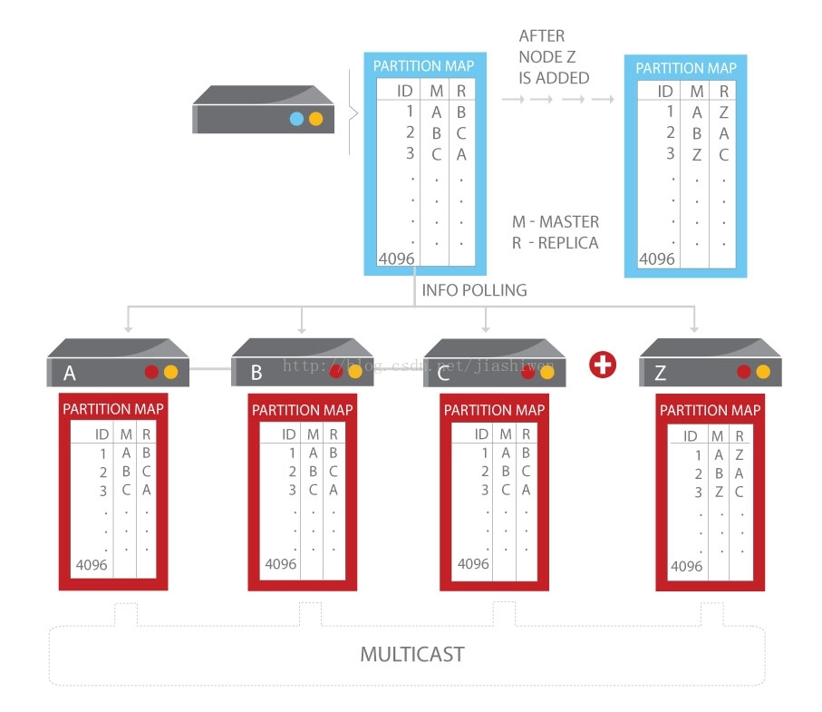

# Aerospike_Development_Guide
Aerospike 是一个分布式、可扩展的数据库。Aerospike 在全球范围内发挥作用并提供了企业级可靠性。Aerospike架构具有三个关键目标：

●为网络规模的应用程序创建一个灵活、可扩展的平台。

●提供传统数据库所期望的健壮性和可靠性（如在 ACID 中）。

●以最少的人工参与提供运营效率。



Aerospike 宣布开源其 NoSQL 数据库，使用 AGPL 许可证发布。该许可证要求对源代码的任意改进都必须提交回主库。Aerospike 相关的所有源码都可通过如下地址获取：

https://github.com/aerospike

Aerospike 当前将数据库打包成两个版本：社区版和企业版。其中社区版是免费的，但限制了集群、存储能力以及每秒的事务处理数。在最新的 3.3.5 版本中这些限制已经移除。社区版跟企业版所提供的功能已经基本一致，除了企业版提供的多个数据中心的复制功能以及补丁和技术支持服务外。 

Aerospike 提供 C, C++, Java, C#, Node.js, Python, PHP, Erlang 和 Perl 语言的客户端开发包，这些客户端开发包的源码使用 Apache 许可证。


在线阅读地址
https://www.gitbook.com/book/kiwimg/aerospike_development_guide/details

##** 参加步骤**

在 GitHub 上 fork 到自己的仓库，如 docker_user/docker_practice，然后 clone 到本地，并设置用户信息。
修改代码后提交，并推送到自己的仓库。
定期使用项目仓库内容更新自己仓库内容。


##**感谢贡献者**


## 翻译校正

>``` 如有翻译不正确或错误，请email联系asun@aerospike.com```
