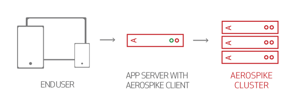
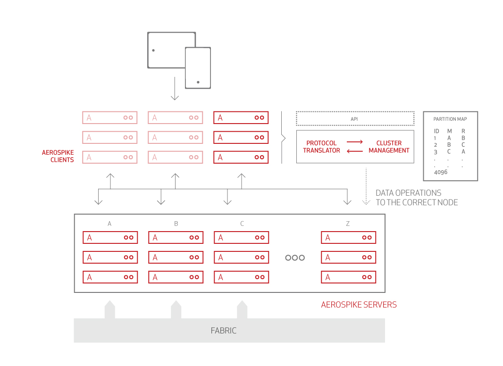

# 客户端

### 概述
Aerospike数据库是一个客户机-服务器体系结构,通常无状态应用程序驻留在一个单独的服务器从Aerospike数据库服务器。

为了与Aerospike集群通信，我们提供了一组数据库的客户端 - 驱动程序 - 即允许访问Aerospike集群。这些客户端都提供相同的基本功能，其中包括传感集群状态，路由交易效率，故障转移和池的网络连接有效。

这些客户端库分布——以源代码的形式构建到应用程序服务器层。他们提供了这样一个负载均衡器功能层不需要运行和高可用性。

当你编译你的应用程序有一个Aerospike客户端API库（例如，C或Java的客户端库），它包括Aerospike智能客户端™，采用二进制线协议连接到集群中的服务器。Aerospike客户端API具有多种功能的高性能和易于开发的本质：

* 跟踪集群状态，使用户，开发者，不必。在任何给定的时刻，客户端使用的信息协议与集群定期沟通和保持形成群集节点的列表。它还使用Aerospike智能分区™算法来确定哪个节点存储数据的一个特定的分区。如有任何更改，簇的大小是由客户端自动跟踪;这样的变化是完全透明的应用。在实践中，这意味着交易将不会在过渡期间失败，并且应用程序不需要节点到达和离开时重新启动。

* 客户端API已经实现连接池,所以不需要自己开发代码,配置集群或管理一个连接池
* 管理事务超时和重发请求，监测。
* 是线程安全的,所以只需要一个实例的处理一个过程。

### 客户端库特性

Aerospike有各种语言的客户端库。C，Java，C++和Python #目前支持所有Aerospike的功能。

有些客户目前只支持增强的键值操作。除了基本的put（）和get（）操作，Aerospike支持“CAS”（安全读/修改/写）操作，数据库内计数器和Memcache的操作。批量get操作允许多个按键的单次往返取。数据结构分为箱（在一个传统的关系型系统类似栏目），有一种每个容器 - 一个整数，字符串，二进制对象，或语言序列化对象。

Aerospike也已经扩展到包括以下内容：

* 复杂的数据类型（CDTS）在一个容器（list和map，可以嵌套）。
* Queries, where bin values can be indexed and the database searched by equality or range.
* User Defined Functions (UDFs), which allow the database processing to be extended by executing application code in Aerospike.
* Aggregations, where a collection of records can be operated on with User Defined Functions and aggregate values returned.
* Large Data Types (LDTs), where a bin contains a data structure which can be very large (1 MB through 1 GB).